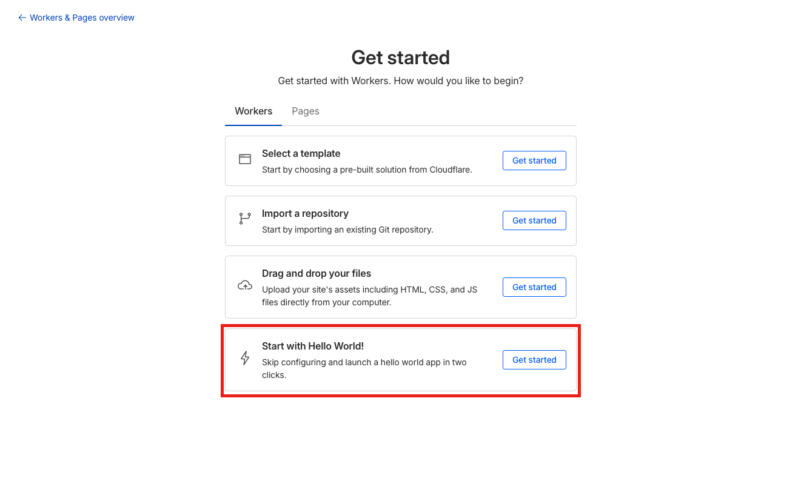

# Deep Research Agent on Cloudflare Workers

A Research Agent powered by Resonate and OpenAI, running on Cloudflare Workers. The Research Agent is a distributed, recursive agent that breaks a research topic into subtopics, researches each subtopic recursively, and synthesizes the results.


## How It Works

This example demonstrates how complex, distributed agentic applications can be implemented with simple code in Resonate's Distributed Async Await: The research agent is a recursive generator function that breaks down topics into subtopics and invokes itself for each subtopic:

```typescript
function* research(ctx, topic, depth) {
  const messages = [
    { role: "system", content: "Break topics into subtopics..." },
    { role: "user", content: `Research ${topic}` }
  ];

  while (true) {
    // Ask the LLM about the topic
    const response = yield* ctx.run(prompt, messages, ...);
    messages.push(response);

    // If LLM wants to research subtopics...
    if (response.tool_calls) {
      const handles = [];

      // Spawn parallel research for each subtopic
      for (const tool_call of response.tool_calls) {
        const subtopic = ...;
        const handle = yield* ctx.beginRpc(research, subtopic, depth - 1);
        handles.push([tool_call, handle]);
      }

      // Wait for all subtopic results
      for (const [tool_call, handle] of handles) {
        const result = yield* handle;
        messages.push({ role: "tool", ..., content: result });
      }
    } else {
      // LLM provided final summary
      return response.content;
    }
  }
}
```

The following video visualizes how this recursive pattern creates a dynamic call graph, spawning parallel research branches that fan out as topics are decomposed, then fan back in as results are synthesized:

https://github.com/user-attachments/assets/cf466675-def3-4226-9233-a680cd7e9ecb

**Key concepts:**
- **Concurrent Execution**: Multiple subtopics are researched concurrently via `ctx.beginRpc`
- **Coordination**: Handles are collected first, then awaited together (fork/join, fan-out/fan-in)
- **Depth control**: Recursion stops when `depth` reaches 0

---

# Running the Example

You can run the Deep Research Agent locally on your machine with Cloudflare's Wrangler or you can deploy the agent to Cloudflare Platform.

## 1. Running Locally

### 1.1. Prerequisites

Install the Resonate Server & CLI with [Homebrew](https://docs.resonatehq.io/operate/run-server#install-with-homebrew) or download the latest release from [Github](https://github.com/resonatehq/resonate/releases).

```
brew install resonatehq/tap/resonate
```

To run this project you also need an [OpenAI API Key](https://platform.openai.com) and export the key as an environment variable

```
export OPENAI_API_KEY="sk-..."
```

### 1.2. Start Resonate Server

Start the Resonate Server. By default, the Resonate Server will listen at `http://localhost:8001`.

```
resonate dev
```

### 1.3. Setup the Deep Research Agent

Clone the repository

```
git clone https://github.com/resonatehq-examples/example-openai-deep-research-agent-cloudflare-ts
cd example-openai-deep-research-agent-cloudflare-ts
```

Install dependencies

```
npm install
```

### 1.4. Start the Deep Research Agent

Start the Cloudflare Function. By default, the Cloudflare Function will listen at `http://localhost:8080`.

```
npm run dev
```

### 1.5. Invoke the Deep Research Agent

Start a research task

```
resonate invoke <promise-id> --func research --arg <topic> --arg <depth> --target <function-url>
```

Example

```
resonate invoke research.1 --func research --arg "What are distributed systems" --arg 1 --target http://localhost:8787
```

### 1.6. Inspect the execution

Use the `resonate tree` command to visualize the research execution.

```
resonate tree research.1
```

## 2. Deploying to Cloudflare

This section guides you through deploying the Deep Research Agent to Cloudflare Platform.

### 2.1 Prerequisites

#### Resonate

Install the Resonate CLI with [Homebrew](https://docs.resonatehq.io/operate/run-server#install-with-homebrew) or download the latest release from [Github](https://github.com/resonatehq/resonate/releases).

```
brew install resonatehq/tap/resonate
```

#### OpenAI

To run this project you need an [OpenAI API Key](https://platform.openai.com).

#### Cloudflare Platform

Ensure you have a [Cloudflare Platform](https://www.cloudflare.com) account.

> [!WARNING]
> Cloudflare Platform offers extensive configuration options. The instructions in this guide provide a baseline setup that you will need to adapt for your specific requirements, organizational policies, or security constraints.

### 2.1 Create a Hello World Worker



### 2.2 Expose the Resonate Server

Expose the Resonate server running locally to the cloud

**Step 1: [cloudflare tunnel](https://developers.cloudflare.com/cloudflare-one/networks/connectors/cloudflare-tunnel/) url (you can use ngrok or similar)**

```
cloudflared tunnel --url http://localhost:8001
```

**Step 2: Run the server locally**

Configure the Resonate Server with its URL.

```
resonate dev --system-url <tunnel-url>
```

Example

```
resonate dev --system-url https://purple-lion-2q3j4j.trycloudflare.com
```

### 2.3 Deploy the Deep Research Agent to Workers

Paste the `wrangler.toml` at the root of this directory (replace the name with the name of your newly created worker)

```toml
name = "XXXXX-XXXXX-XXXX"
main = "src/index.ts"
compatibility_date = "2024-01-01"
```

Deploy it

```
npm run deploy
```

### 2.4 Invoke the Deep Research Agent (Do not forget to set the API key as env variable at cloudflare)

Start a research task

```
resonate invoke <promise-id> --func research --arg <topic> --arg <depth> --target <function-url>
```

Example

```
resonate invoke research.1 --func research --arg "What are distributed systems" --arg 1 --target https://xxxxx-xxxxx-xxxx.abc.workers.dev
```

### 2.5. Inspect the execution

Use the `resonate tree` command to visualize the countdown execution.

```
resonate tree research.1
```

```
research.1
├── research.1.0 🟢 (run)
├── research.1.1 🟡 (rpc research)
│   └── research.1.1.0 🟡 (run)
├── research.1.2 🟡 (rpc research)
│   └── research.1.2.0 🟡 (run)
└── research.1.3 🟡 (rpc research)
    └── research.1.3.0 🟡 (run)
```

## Troubleshooting

If you are still having trouble please [open an issue](https://github.com/resonatehq-examples/example-openai-deep-research-agent-cloudflare-ts/issues).
